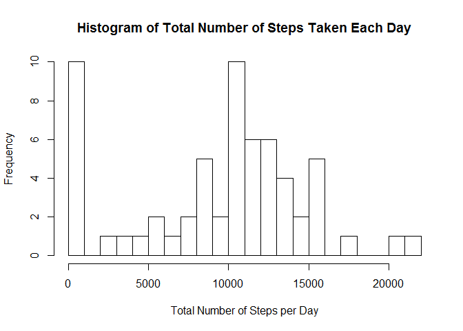
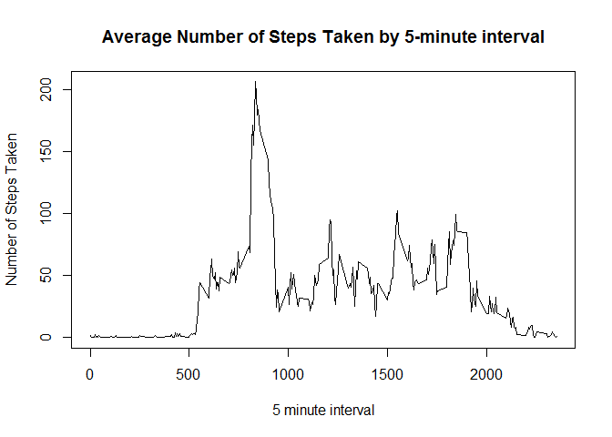
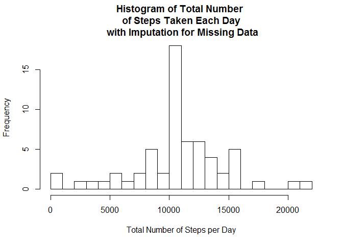
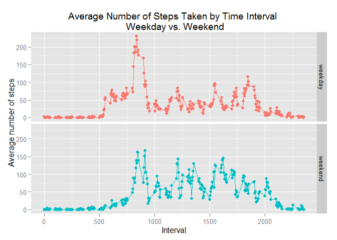

# Reproducible Research: Peer Assessment 1


## Loading and preprocessing the data
The data for this project was obtained via a forked GitHub repository, which can be found here: 
[link] https://github.com/rdpeng/RepData_PeerAssessment1.  

Begin by checking that any needed packages are installed and then load them into R.  

```r
if("plyr" %in% rownames(installed.packages()) == FALSE) {install.packages("plyr")}
if("ggplot2" %in% rownames(installed.packages()) == FALSE) {install.packages("ggplot2")}
if("lubridate" %in% rownames(installed.packages()) == FALSE) {install.packages("lubridate")}
library(plyr)
library(ggplot2)
library(lubridate)
```

Next, unzip and load the data 'activity' from the forked repository.

```r
unzip("activity.zip")
activity<-read.csv("activity.csv")
```
  
Now that the data is loaded into R, do some basic processing and preparation for analysis.

```r
# put date into "Date" format
activity$Date<-as.Date(as.character(activity$date), "%Y-%m-%d" )

# determine day of week
activity$weekday<-wday(activity$Date,label=TRUE)

#remove original date column from df
activity$date<-NULL
```
  
Create a marker for weekend or weekday.  (There might be a more efficient way to do this, but the following was effective.)  A factor variable will be constructed from this column in the last part of this assignment.  

```r
# create a new df with 2 columns: day of week and weekend marker
day<-data.frame(unique(activity$weekday))

wk<-data.frame(day[1:5,]) # weekday values
wk$weekend<-FALSE
colnames(wk)<-c("day","weekend")
    
we<-data.frame(day[6:7,]) # weekend values
we$weekend<-TRUE
colnames(we)<-c("day","weekend")

weekend<-rbind(wk, we) # combine weekend and weekday values from above into a single df

# add these markers to main 'activity' file
activity<-merge(activity, weekend, by.x="weekday", by.y="day") 
```

  
    
    
## What is mean total number of steps taken per day?
Begin by determining the total # of steps taken each day.

```r
TotDailySteps<-ddply(activity, c("Date"), summarise,totSteps=sum(steps,na.rm=TRUE))
```

The distribution of the total number of steps can be observed in the following histogram.  

```r
hist(TotDailySteps$totSteps, 
     breaks=20,
     main="Histogram of Total Number of Steps Taken Each Day",
     xlab="Total Number of Steps per Day")
```

 
  
Then, find the average and median number of total steps taken per day.

```r
MeanStepsPerDay<-mean(TotDailySteps$totSteps,na.rm=TRUE)
MedianStepsPerDay<-median(TotDailySteps$totSteps,na.rm=TRUE)
```
Mean number of steps:
[1] 9354.23
  
Median number of steps:
[1] 10395
  
  
## What is the average daily activity pattern?
Next, we can look more closely at average activity patterns throughout the day.  To do this, begin by computing the number of steps taken in each time interval, averaged across days.  

```r
StepsByInterval<-ddply(activity, c("interval"), summarise,meanSteps=mean(steps,na.rm=TRUE))
```
   
The following plot shows the number of steps taken per time interval, averaged across days.  

```r
plot(StepsByInterval$interval, StepsByInterval$meanSteps,type='l',
     xlab = '5 minute interval', ylab='Number of Steps Taken',
     main="Average Number of Steps Taken by 5-minute interval")
```

 
  
We can determine the interval with the maximum number of steps from the computed measure above.  

```r
sortorder<-order(StepsByInterval$meanSteps, na.last=NA, decreasing=TRUE)
MaxAvgStepsInterval<-StepsByInterval[sortorder,]
MaxAvgStepsInterval[1:1,1:2]
```

```
##     interval meanSteps
## 104      835  206.1698
```
  
## Imputing missing values
There are a number of missing values (coded as NA) for steps taken as shown below.

```r
activity$missing<-is.na(activity$steps)
Nmissing<-sum(activity$missing)
print(Nmissing)
```

```
## [1] 2304
```

The presence of a large number of missing days may introduce bias into some calculations or summaries of the data.  As such, we will use a simple method to impute the missing values.  A sample plot was done, which showed that using an interval-based average would be a good approach.  

```r
#ggplot(activity, aes(x=interval, y=steps, group=Date, colour=interval))+geom_line()+geom_point()
```
To do the imputation, the activity data was first merged with the data averaged by interval, which was computed earlier.

```r
withImputed<-merge(activity,StepsByInterval,by="interval")
```
Then, the following code was used to assign values to the new series that includes imputations.  

```r
#first define a new empty column in the new 'withImputed' dataframe
withImputed$stepsImp<-NA 

#then, fill in actual values for observations where the steps data are not missing
withImputed$stepsImp[which(withImputed$missing==FALSE)]<-withImputed$steps[which(withImputed$missing==FALSE)]

#lastly, fill in the interval average values for observations where the steps data were missing.
withImputed$stepsImp[which(withImputed$missing==TRUE)]<-withImputed$meanSteps[which(withImputed$missing==TRUE)]
```

Using the new dataset that includes imputations, we can recompute the total number of daily steps.  We can then create a new histogram for the new series with imputations.

```r
TotDailyStepsImp<-ddply(withImputed, c("Date"), summarise,totSteps=sum(stepsImp,na.rm=TRUE))

hist(TotDailyStepsImp$totSteps, 
     breaks=20,
     main="Histogram of Total Number \n of Steps Taken Each Day \n with Imputation for Missing Data",
     xlab="Total Number of Steps per Day")
```

 
  
The new histogram (based on the series with imputation) shows no days with 0 steps taken,in contrast to the original histogram shown on the raw observed data. Further, there is much greater concentration of the data near the middle, or just over 10,000 steps per day.  
  We can also review the patterns in the mean and median values using the series with imputation versus the original series. 

```r
MeanStepsPerDayImp<-mean(TotDailyStepsImp$totSteps,na.rm=TRUE)
MedianStepsPerDayImp<-median(TotDailyStepsImp$totSteps,na.rm=TRUE)
```
Mean number of steps:
[1] 10766.19
  
Median number of steps:
[1] 10766.19
  
Both the mean and median are higher when the data on total number of steps include imputations for missing values.  Further, the mean and median have converged to the same value. 
  
  
## Are there differences in activity patterns between weekdays and weekends?  
The weekdays() function was used in part 1 (data preprocessing) to extract the appropriate day of the week for a particular date. A new factor variable can be constructed indicating whether the day falls on a "weekend" or "weekday".  This can be done using the logical indicator weekend that was computed in the data processing stage.

```r
withImputed$WEorWD<-"NA"
withImputed$WEorWD[which(withImputed$weekend==FALSE)]<-"weekday"
withImputed$WEorWD[which(withImputed$weekend==TRUE)]<-"weekend"
withImputed$WDorWE<-as.factor(withImputed$WEorWD)
withImputed$WEorWD<-NULL
```
A panel plot of average steps by interval can illustrate similarities and differences in activity patterns on weekdays and weekends as follows.  


```r
# first, compute the average steps by interval on weekends and weekdays.
StepsByIntervalWE<-ddply(withImputed, c("interval","WDorWE"), summarise,meanSteps=mean(stepsImp,na.rm=TRUE))

# next, make a time series plot with 2 separate panels using ggplot
ggplot(StepsByIntervalWE, aes(x=interval, y=meanSteps, group=WDorWE, colour=WDorWE))+
    geom_line()+geom_point()+facet_grid(WDorWE~.)+
    scale_y_continuous(name="Average number of steps")+scale_x_continuous(name="Interval")+
    labs(title="Average Number of Steps Taken by Time Interval \n Weekday vs. Weekend")+
    theme(legend.position="none")
```

 
  
Not surprisingly, the patterns for weekdays and weekends differ to some extent.  For example, weekday activity (based on # of steps taken) appears to be highest in the morning and evening, with a lull in the middle of the day.  On weekends, activity is distributed more evenly throughout the day, without a dropoff in the late morning and afternoon hours.


